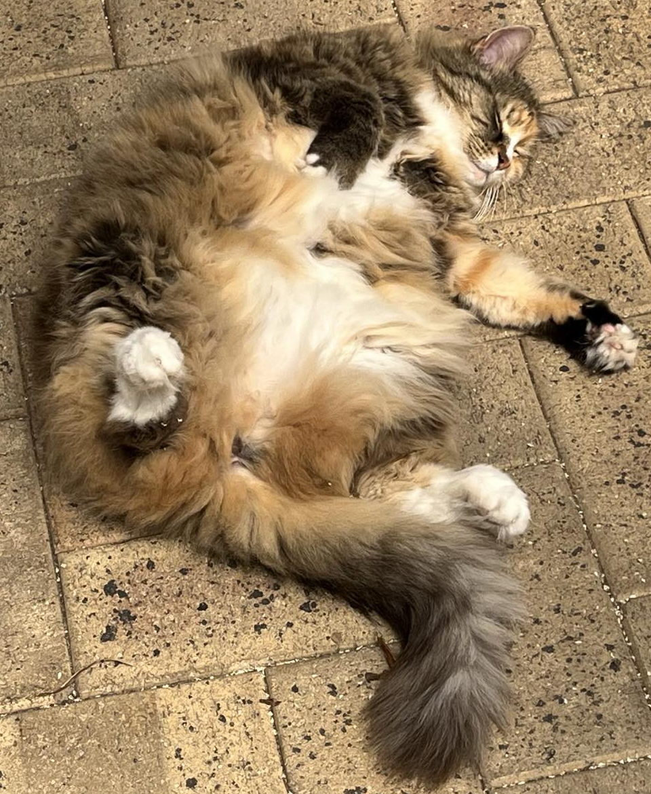

# HARDWARE

This homelab operates on 100% cat power.

 <table>
  <tr>
    <th>Cat</th>
    <th>Name</th>
    <th>Model</th>
    <th>Hardware</th>
    <th>Role</th>
  </tr>
  <tr>
    <td></td>
    <td>Monty</td>
    <td>Lenovo Thinkcentre M73 Tiny Form Factor</td>
    <td>128Gb HDD, 8Gb RAM</td>
    <td>Kubernetes Master Node</td>
  </tr>
  <tr>
    <td></td>
    <td>Crackers</td>
    <td>Lenovo Thinkcentre M73 Tiny Form Factor</td>
    <td>128Gb HDD, 12Gb RAM</td>
    <td>Kubernetes Worker Node</td>
  </tr>
  <tr>
    <td></td>
    <td>Mindy</td>
    <td>HP EliteDesk 800 G1 Base Model Desktop Mini PC</td>
    <td>256Gb HDD, 8Gb RAM</td>
    <td>Kubernetes Worker Node</td>
  </tr>
  <tr>
    <td></td>
    <td>Brocky</td>
    <td>Seagate NAS</td>
    <td>2TB storage</td>
    <td>Network Attached Storage</td>
  </tr>
</table>

Comments:
 * Zigbee usb adapter tied to crackers - using a Electrolama zig-a-zig-ah! (zzh)
 * UPS managed via usb on monty
 * Mindy can be managed by vPro
